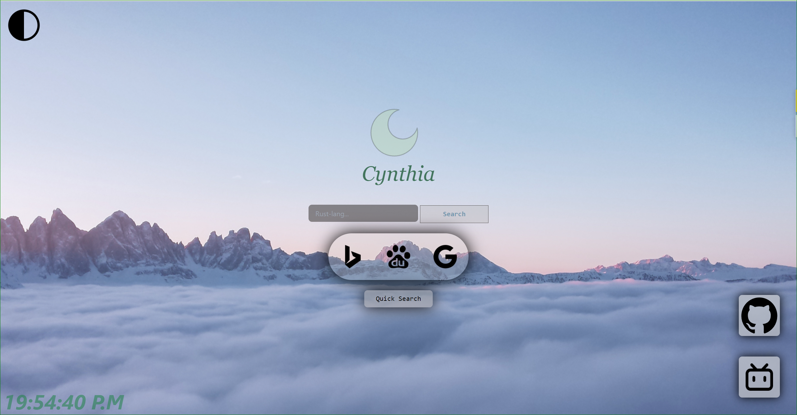

# Cynthia Start Page

---

### Cynthia Start Page is a Start page make with TailWindCSS

#### Depend

|name |version|
| :--:|:--:|
| yarn|v2.1.0|
|TailWindCSS|v3.0.0|

#### command

##### download

```
git clone https://github.com/aicookie/Cynthia
```

##### run

```
yarn dev
```

##### build

```
yarn build
```

#### how to use it?

if you want to do some change:

  1. download it
  2. cd to the project folder
  3. run it and you can do some change

if you want to set it to your start page:

  1. download it
  2. cd to the project folder
  3. build it
  4. open the browser
  5. open the settings and set index.html to the StartPage

### what do we do now?

1. 2022 06.3
    1. Cynthia Start Page Start to Build
    2. build the Cynthia Quick Search Beta-0.1
2. 2022 06.8
     1. build the Cynthia Quick Search Version 0.5
3. 2022 06.13
   1. add the Dark Mode
4. 2022 6.14
   1. upload the project to Github

5. 2022 6.15
1. add the icon border

### what do we do next?

1. 2022 6, 2022 7
   1. add the search tips
   2. add the weather report component

### Screenshot

  
<!-- 
# Tailwind CSS Boilerplate

[](https://app.netlify.com/sites/tailwind-css-boilerplate/deploys)

Setting up a tailwind css based project needs to install the tailwindcss npm package, postcss and autoprefixer - it also requires to configure a tailwind.config.js as well as postcss.config.js (optional, if you're planning to use postcss) and then configure those files manually.

And finally for building the production code with tree-shaking (removing unused css from your project and keeping only what is required) you need to configure the purge settings in your tailwind configuration. For someone new to tailwind and for others who regularly use tailwind in their projects, these are boring jobs and you have to do it repeatedly for every project (or learn how to do it if someone is just starting with tailwind)

So this boilerplate has all the configuration to save your time from this boring configurtion tasks (and from gogling many things)

Use this boilerplate as the starting point for your JAMstack + **Tailwind CSS** based projects.

### start
```sh
git clone this_repository
cd this_directory
yarn
yarn dev
```

### build
```sh
yarn build
```

then grab everything from the dist folder

### change server port
Just change the port number in `vite.config.js` file
```javascript
export default {
    plugins: [],
    server: {
      open: '/index.html',
      port: 3116, //< -change this
    }
}

```

### configure tailwind
There is a `tailwind.config.js` file with `purge` instructions and extra colors, feel free to customize it according to your need
 -->
